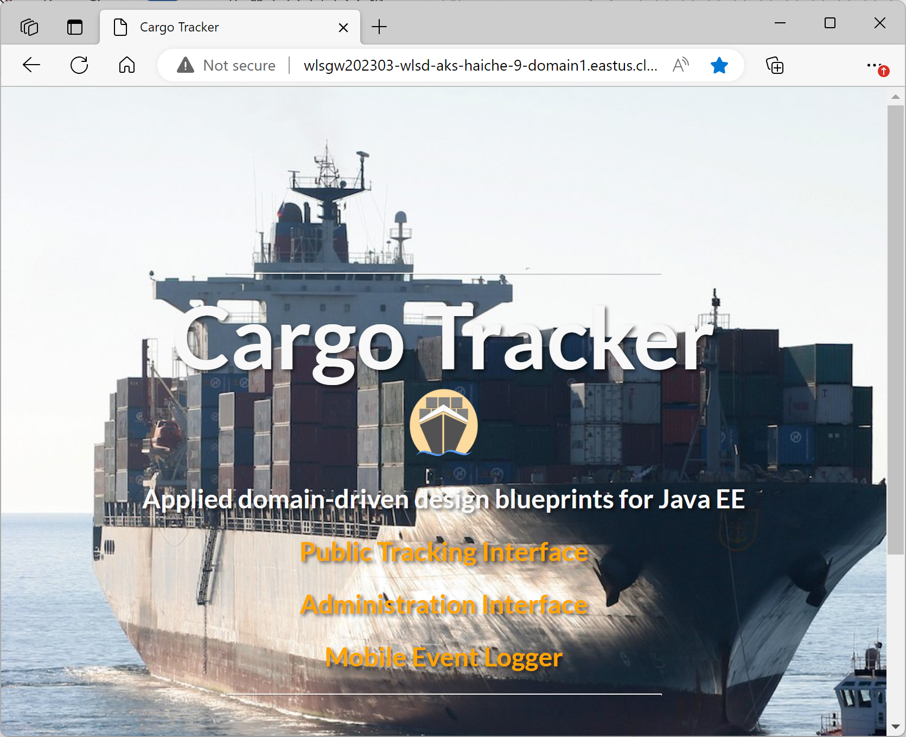

# Oracle WebLogic Server Cargo Tracker Application Deployed to Azure Kubernetes Service (AKS)

## Description

This is a sample app template of the Domain-Driven Design Jakarta EE application. The application is built with Maven and deployed to Oracle WebLogic Server running in Azure Kubernetes Service (AKS). The app template uses the [official Azure offer for running WLS on AKS](https://aka.ms/wls-aks-portal). For a quickstart on this offer, see [https://aka.ms/wls-aks-quickstart](https://aka.ms/wls-aks-quickstart). The application is exposed by Azure Application Gateway.

## Deploy Oracle WebLogic Server Application to Azure Kubernetes Service:

--
Tech stack:

- Azure Infra (VNet)
- Azure Storage Account
- Azure Container Registry
- Azure Kubernetes Service
- Azure Application Gateway
- Azure PostgreSQL DB
- GitHub Actions
- Bicep
- Docker
- Maven
- Java

---

## Introduction

This is a quickstart template. It deploys the following:

* Deploying Cargo Tracker App:
  * Create ProgresSQL Database
  * Create the Cargo Tracker - build with Maven
  * Provisioning Azure Infra Services with ARM templates - build with BICEP
    * Create an Azure Container Registry
    * Build your app, Oracle WebLogic Server and domain configuration models into an image
    * Push your app image to the container registry
    * Create an Azure Kubernetes Service  
    * Deploy your app to AKS
    * Create an Azure Application Gateway
    * Expose your app with the application gateway
  * Verify your app

* Cargo Tracker on Automated CI/CD with GitHub Action
  * CI/CD on GitHub Action
  * CI/CD in action with the app

> Refer to the [App Templates](https://github.com/microsoft/App-Templates) repo Readme for more samples that are compatible with [AzureAccelerators](https://github.com/Azure/azure-dev/).

## Prerequisites

- Local shell with Azure CLI installed or [Azure Cloud Shell](https://ms.portal.azure.com/#cloudshell/)
- Azure Subscription, on which you are able to create resources and assign permissions
  - View your subscription using ```az account show``` 
  - If you don't have an account, you can [create one for free](https://azure.microsoft.com/free). 
- You must have an Oracle account. To create an Oracle account and accept the license agreement for WebLogic Server images, follow the steps in [Oracle Container Registry](https://aka.ms/wls-aks-ocr). Make note of your Oracle Account password and email.
- GitHub CLI (optional, but strongly recommended). To install the GitHub CLI on your dev environment, see [Installation](https://cli.github.com/manual/installation).


## Getting Started

1. Fork the repository by clicking the 'Fork' button on the top right of the page.
This creates a local copy of the repository for you to work in. 

2. Configure GITHUB Actions:  Follow the instructions in the [GITHUB_ACTIONS_CONFIG.md file](.github/GITHUB_ACTIONS_CONFIG.md) (Located in the .github folder.)

4. Manually run the workflow

* Under your repository name, click Actions.
* In the left sidebar, click the workflow "Setup WLS on AKS".
* Above the list of workflow runs, select Run workflow.
* Configure the workflow.
  + Use the Branch dropdown to select the workflow's main branch.
  + For **Included in names to disambiguate. Get from another pipeline execution**, enter disambiguation prefix, e.g. `test01`.

5. Click Run workflow.

## Workflow description

As mentioned above, the app template uses the [official Azure offer for running WLS on AKS](https://aka.ms/wls-aks-portal). The workflow uses the source code behind that offer by checking it out and invoking it from Azure CLI.

### Job: preflight

This job is to build WLS on AKS template into a ZIP file containing the ARM template to invoke.

* Set up environment to build the WLS on AKS templates
  + Set up JDK 1.8
  + Set up bicep 0.11.1

* Download dependencies
  + Checkout azure-javaee-iaas, this is a precondition necessary to build WLS on AKS templates. For more details, see [Azure Marketplace Azure Application (formerly known as Solution Template) Helpers](https://github.com/Azure/azure-javaee-iaas).

* Checkout and build WLS on AKS templates
  + Checkout ${{ env.aksRepoUserName }}/weblogic-azure. Checkout [oracle/weblogic-azure](https://github.com/oracle/weblogic-azure) by default. This repository contains all the BICEP templates that provision Azure resources, configure WLS and deploy app to AKS. 
  + Build and test weblogic-azure/weblogic-azure-aks. Build and package the WLS on AKS templates into a ZIP file (e.g. wls-on-aks-azure-marketplace-1.0.56-arm-assembly.zip). The structure of the ZIP file is:

    ```text
    ├── mainTemplate.json (ARM template that is built from BICEP files, which will be invoked for the following deployments)
    └── scripts (shell scripts and metadata)
    ```

  + Archive weblogic-azure/weblogic-azure-aks template. Upload the ZIP file to the pipeline. The later jobs will download the ZIP file for further deployments.

### Job: deploy-db

This job is to deploy PostgreSQL server and configure firewall setting.

* Set Up Azure Database for PostgreSQL
  + azure-login. Login Azure.
  + Create Resource Group. Create a resource group to which the database will deploy.
  + Set Up Azure Postgresql to Test dbTemplate. Provision Azure Database for PostgreSQL Single Server. The server allows access from Azure services.

### Job: deploy-storage-account

This job is to build Cargo Trakcer and deploy an Azure Storage Account with a container to store the application.

* Build Cargo Trakcer
  + Checkout cargotracker. Checkout Cargo Trakcer from this repository.
  + Maven build web app. Build Cargo Trakcer with Maven. The war file locates in `cargotracker/target/cargo-tracker.war`

* Provision Storage Account and container
  + azure-login. Login Azure.
  + Create Resource Group. Create a resource group to which the storage account will deploy.
  + Create Storage Account. Create a storage account with name `${{ env.storageAccountName }}`.
  + Create Storage Container. Create a container with name `${{ env.storageContainerName }}`.

* Upload Cargo Trakcer to the container
  + Upload built web app war file. Upload the application war file to the container using AZ CLI commands. The URL of the war file will pass to the ARM template as a parameter when deploying WLS on AKS templates.

### Job: deploy-wls-on-aks

This job is to provision Azure resources, configure WLS, run WLS on AKS and deploy the application to WLS using WLS on AKS solution template.

* Download the WLS on AKS solution template
  + Checkout ${{ env.aksRepoUserName }}/weblogic-azure. Checkout [oracle/weblogic-azure](https://github.com/oracle/weblogic-azure) to find the version information.
  + Get version information from weblogic-azure/weblogic-azure-aks/pom.xml. Get the version info for solution template ZIP file, which is used to generate the ZIP file name: `wls-on-aks-azure-marketplace-${version}-arm-assembly.zip`
  + Output artifact name for Download action. Generate and output the ZIP file name: `wls-on-aks-azure-marketplace-${version}-arm-assembly.zip`.
  + Download artifact for deployment. Download the ZIP file that is built in job:preflight.

* Deploy WLS on AKS
  + azure-login. Login Azure.
  + Query web app blob url and set to env. Obtain blob url for cargo-tracker.war, which will server as a parameter for the deployment.
  + Create Resource Group. Create a resource group for WLS on AKS.
  + Checkout cargotracker. Checkout the parameter template.
  + Prepare parameter file. Set values to the parameters.
  + Validate Deploy of WebLogic Server Cluster Domain offer. Validate the parameters file in the context of the bicep template to be invoked. This will catch some errors before taking the time to start the full deployment. `--template-file` is the mainTemplate.json from solution template ZIP file. `--parameters` is the parameter file created in last step.
  + Deploy WebLogic Server Cluster Domain offer. Invoke the mainTemplate.json to deploy resources and configurations. After the deployment completes, you'll get the following result:
    + An Azure Container Registry and a WLS image that contains Cargo Tracker in the ACR repository.
    + An Azure Kubernetes Service with WLS running in `sample-domain1-ns` namespace, including 1 pod for WLS admin server and 2 pods for managed server.
    + An Azure Application Gateway that is able to route to the backend WLS pods. You can access the application using `http://<gateway-hostname>/cargo-tracker/`

* Enable Cargo Tracker with full operations
  + Connect to AKS cluster. Though the application is accessible, but some functionalities are not ready. We have to apply JMS configuration in `src/test/aks/cargo-tracker-jms.yaml` to WLS cluster. This step is to connect to AKS cluster to update WLS configuration.
  + Generate&Apply configmap. Append JMS configuration in `src/test/aks/cargo-tracker-jms.yaml` to WLS configuration, which is stored in configmap `sample-domain1-wdt-config-map` in `sample-domain1-ns` namespace. Then the step causes a rolling update on the WLS pods.
  + Verify pods are restarted. This step is to wait for WLS cluster ready. You can follow steps in [Exercise the Cargo Tracker app](https://www.ridingthecrest.com/javaland-javaee/wls#exercise-the-cargo-tracker-app) to validate the JMS configuration.

## Cargo Tracker Website



If you wish to view the Cargo Tracker Deployment, you have the following options:

- Log into the Azure Portal
- Navigate to the `wlsd-aks-<your-disambiguate-prefix>-<number>` Resource Group
- Select **Settings**, **Deployments**, **wls-on-aks**, **Outputs**, you will see `clusterExternalUrl`. The application URL is `${clusterExternalUrl}cargo-tracker/`.
- Open your web browser, navigate to the application URL, you will see the Cargo Tracker landing page.

## Exercise Cargo Tracker Functionality

1. On the main page, select **Public Tracking Interface** in new window. 

   1. Enter **ABC123** and select **Track!**

   1. Observe what the **next expected activity** is.

1. On the main page, select **Administration Interface**, then, in the left navigation column select **Live** in a new window.  This opens up a map view.

   1. Mouse over the pins and find the one for **ABC123**.  Take note of the information in the hover window.

1. On the main page, select **Mobile Event Logger**.  This opens up in a new, small, window.

1. Drop down the menu and select **ABC123**.  Select **Next**.

1. Select the **Location** using the information in the **next expected activity**.  Select **Next**.

1. Select the **Event Type** using the information in the **next expected activity**.  Select **Next**.

1. Select the **Voyage** using the information in the **next expected activity**.  Select **Next**.

1. Set the **Completion Date** a few days in the future.  Select **Next**.

1. Review the information and verify it matches the **next expected activity**.  If not, go back and fix it.  If so, select **Submit**.

1. Back on the **Public Tracking Interface** select **Tracking** then enter **ABC123** and select **Track**.  Observe that a different. **next expected activity** is listed.

1. If desired, go back to **Mobile Event Logger** and continue performing the next activity.

## Learn more about Cargo Tracker

See [Eclipse Cargo Tracker - Applied Domain-Driven Design Blueprints for Jakarta EE](cargo-tracker.md)
