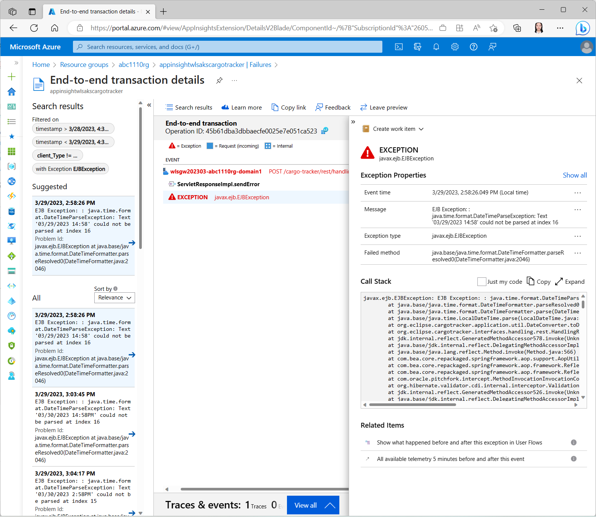

# Deploy Cargo Tracker to Oracle WebLogic Server on Azure Kubernetes Service (AKS)

This quickstart shows you how to deploy an existing Java WebLogic application to AKS using WLS on AKS solution templates. When you're finished, you can continue to manage the application via the Azure CLI or Azure Portal.

The [official Azure offer for running WLS on AKS](https://aka.ms/wls-aks-portal) enables you to easily run a WebLogic applications on AKS. For a quickstart on this offer, see [https://aka.ms/wls-aks-quickstart](https://aka.ms/wls-aks-quickstart).

* [Deploy Cargo Tracker to Oracle WebLogic Server on Azure Kubernetes Service (AKS)]()
  * [Introduction](#introduction)
  * [Prerequisites](#prerequisites)
  * [Unit-1 - Deploy and monitor Cargo Tracker](#unit-1---deploy-and-monitor-cargo-tracker)
    * [Clone and build Cargo Tracker](#clone-and-build-cargo-tracker)
    * [Prepare your variables for deployments](#prepare-your-variables-for-deployments)
    * [Clone WLS on AKS Bicep templates](#clone-wls-on-aks-bicep-templates)
    * [Sign in to Azure](#sign-in-to-azure)
    * [Create a resource group](#create-a-resource-group)
    * [Create Azure Storage Account and upload the application](#create-azure-storage-account-and-upload-the-application)
    * [Create an Azure Database for PostgreSQL instance](#create-an-azure-database-for-postgresql-instance)
    * [Prepare deployment parameters](#prepare-deployment-parameters)
    * [Invoke WLS on AKS Bicep template to deploy the application](#invoke-wls-on-aks-bicep-template-to-deploy-the-application)
    * [Configure JMS](#configure-jms)
    * [Monitor WebLogic application](#monitor-weblogic-application)
      * [Create Application Insights](#create-application-insights)
      * [Use Cargo Tracker and make a few HTTP calls](#use-cargo-tracker-and-make-a-few-http-calls)
      * [Start monitoring Cargo Tracker in Application Insights](#start-monitoring-cargo-tracker-in-application-insights)
      * [Start monitoring WebLogic logs in Azure Log Analytics](#start-monitoring-weblogic-logs-in-azure-log-analytics)
      * [Start monitoring Cargo Tracker logs in Azure Log Analytics](#start-monitoring-cargo-tracker-logs-in-azure-log-analytics)
  * [Unit-2 - Automate deployments using GitHub Actions](#unit-2---automate-deployments-using-github-actions)
  * [Appendix 1 - Exercise Cargo Tracker Functionality](#appendix-1---exercise-cargo-tracker-functionality)
  * [Appendix 2 - Learn more about Cargo Tracker](#appendix-2---learn-more-about-cargo-tracker)

## Introduction

In this quickstart, you will:
* Build Cargo Tracker.
* Deploying Cargo Tracker
  * Create PostgreSQL Database
  * Provisioning Azure Infra Services with Azure BICEP
    * Create an Azure Container Registry
    * Build Cargo Tracker, Oracle WebLogic Server and domain configuration models into an image
    * Push the application image to the container registry
    * Create an Azure Kubernetes Service  
    * Deploy the application to AKS
    * Create an Azure Application Gateway
    * Expose the application with the application gateway
  * Verify the application
  * Monitor application
  * Automate deployments using GitHub Actions

## Prerequisites

- Local shell with Azure CLI 2.46.0 and above or [Azure Cloud Shell](https://ms.portal.azure.com/#cloudshell/).
- Azure Subscription, on which you are able to create resources and assign permissions.
  - View your subscription using ```az account show``` 
  - If you don't have an account, you can [create one for free](https://azure.microsoft.com/free). 
  - Your subscription is accessed using an Azure Service Principal with at least **Contributor** and **User Access Administrator** permissions.
- An Oracle account. To create an Oracle account and accept the license agreement for WebLogic Server images, follow the steps in [Oracle Container Registry](https://aka.ms/wls-aks-ocr). Make note of your Oracle Account password and email.
- We strongly recommend you use Azure Cloud Shell. For local shell, make sure you have installed the following tools.
  - A Java JDK, Version 11. Azure recommends [Microsoft Build of OpenJDK](https://learn.microsoft.com/en-us/java/openjdk/download). Ensure that your `JAVA_HOME` environment.
  - [Git](https://git-scm.com/downloads). use `git --version` to test whether git works. This tutorial was tested with version 2.25.1.
  - GitHub CLI (optional, but strongly recommended). To install the GitHub CLI on your dev environment, see [Installation](https://cli.github.com/manual/installation).
  - [kubectl](https://kubernetes-io-vnext-staging.netlify.com/docs/tasks/tools/install-kubectl/); use `kubectl version` to test if `kubectl` works. This document was tested with version v1.21.1.
  - [Maven](https://maven.apache.org/download.cgi). use `mvn -version` to test whether `mvn` works. This tutorial was tested with version 3.6.3.

## Unit-1 - Deploy and monitor Cargo Tracker

### Clone and build Cargo Tracker

Clone the sample app repository to your development environment.

```bash
mkdir cargotracker-wls-aks
DIR="$PWD/cargotracker-wls-aks"

git clone https://github.com/Azure-Samples/cargotracker-wls-aks.git ${DIR}/cargotracker
```

Change directory and build the project.

```bash
mvn clean install -PweblogicOnAks --file ${DIR}/cargotracker/pom.xml
```

After the Maven command completes, the WAR file locates in `${DIR}/cargotracker/target/cargo-tracker.war`.

### Prepare your variables for deployments

Create a bash script with environment variables by making a copy of the supplied template:

```bash
cp ${DIR}/cargotracker/.scripts/setup-env-variables-template.sh ${DIR}/cargotracker/.scripts/setup-env-variables.sh
```

Open `${DIR}/cargotracker/.scripts/setup-env-variables.sh` and enter the following information. Make sure your Oracle SSO user name and password are correct.

```bash
export WLS_AKS_REPO_REF="95bd2e7258ac97ac1b82c59eed82a0492653794f" # oracle/weblogic-azure reference
export RESOURCE_GROUP_NAME="abc1110rg" # customize this
export STORAGE_ACCOUNT_NAME="stgwlsaks$(date +%s)" # storage account name
export DB_SERVER_NAME="wlsdb$(date +%s)" # PostgreSQL server name
export DB_PASSWORD="Secret123456" # PostgreSQL database password

export MY_ORACLE_SSO_USER="user@contoso.com" # replace with your Oracle Account user name.
export MY_ORACLE_SSO_PASSWORD="Secret123456" # replace with your Oracle Account password.

export MY_WEBLOGIC_ADMIN_USER_NAME="weblogic" # weblogic admin user name
export MY_WEBLOGIC_ADMIN_PASSWORD="Secret123456" # weblogic admin password
```

Then, set the environment:

```bash
source ${DIR}/cargotracker/.scripts/setup-env-variables.sh
```

### Clone WLS on AKS Bicep templates

Clone the Bicep templates from [oracle/weblogic-azure](https://github.com/oracle/weblogic-azure). This quickstart was tested with [commit 364b764](https://github.com/oracle/weblogic-azure/commit/95bd2e7258ac97ac1b82c59eed82a0492653794f). 

```bash
git clone https://github.com/oracle/weblogic-azure.git ${DIR}/weblogic-azure

cd ${DIR}/weblogic-azure
git checkout ${WLS_AKS_REPO_REF}

cd ${DIR}
```

### Sign in to Azure

If you haven't already, sign in to your Azure subscription by using the `az login` command and follow the on-screen directions.

```bash
az login
```

If you have multiple Azure tenants associated with your Azure credentials, you must specify which tenant you want to sign in to. You can do this with the `--tenant option`. For example, `az login --tenant contoso.onmicrosoft.com`.

### Create a resource group

Create a resource group with `az group create`. Resource group names must be globally unique within a subscription.

```bash
az group create \
    --name ${RESOURCE_GROUP_NAME} \
    --location eastus
```

### Create Azure Storage Account and upload the application

To deploy a Java EE application along with the WLS on AKS offer deployment. You have to upload the application file (.war, .ear, or .jar) to a pre-existing Azure Storage Account and Storage Container within that account.

Create an Azure Storage Account using the `az storage account create` command, as shown in the following example:

```bash
az storage account create \
    --resource-group ${RESOURCE_GROUP_NAME} \
    --name ${STORAGE_ACCOUNT_NAME} \
    --location eastus \
    --sku Standard_RAGRS \
    --kind StorageV2
```

Create a container for storing blobs with the `az storage container create` command, with public access enabled.

```bash
az storage container create \
    --account-name ${STORAGE_ACCOUNT_NAME} \
    --name mycontainer \
    --public-access container
```

Next, upload Cargo Tracker to a blob using the `az storage blob upload` command.

```bash
az storage blob upload \
    --account-name ${STORAGE_ACCOUNT_NAME} \
    --container-name mycontainer \
    --name cargo-tracker.war \
    --file ${DIR}/cargotracker/target/cargo-tracker.war
```

Obtain the blob URL, which will be used as a deployment parameter.

```bash
APP_URL=$(az storage blob url \
  --account-name ${STORAGE_ACCOUNT_NAME} \
  --container-name mycontainer \
  --name cargo-tracker.war -o tsv)
```

### Create an Azure Database for PostgreSQL instance

Use `az postgres server create` to provision a PostgreSQL instance on Azure. The data server allows access from Azure Services.

```bash
az postgres server create \
  --resource-group ${RESOURCE_GROUP_NAME} \
  --name ${DB_SERVER_NAME}  \
  --location eastus \
  --admin-user weblogic \
  --ssl-enforcement Disabled \
  --public-network-access Enabled \
  --admin-password ${DB_PASSWORD} \
  --sku-name B_Gen5_1

  echo "Allow Access To Azure Services"
  az postgres server firewall-rule create \
  -g ${RESOURCE_GROUP_NAME} \
  -s ${DB_SERVER_NAME} \
  -n "AllowAllWindowsAzureIps" \
  --start-ip-address "0.0.0.0" \
  --end-ip-address "0.0.0.0"
```

Obtain the JDBC connection string, which will be used as a deployment parameter.

```bash
DB_CONNECTION_STRING="jdbc:postgresql://${DB_SERVER_NAME}.postgres.database.azure.com:5432/postgres"
```

### Prepare deployment parameters

Several parameters are required to invoke the Bicep templates. Parameters and their value are listed in the table. Make sure the variables have correct value.

| Parameter Name | Value | Note |
| -------------| ---------- | -----------------|
| `_artifactsLocation` | `https://raw.githubusercontent.com/oracle/weblogic-azure/${WLS_AKS_REPO_REF}/weblogic-azure-aks/src/main/arm/` | This quickstart is using templates and scripts from `oracle/weblogic-azure/${WLS_AKS_REPO_REF}` |
| `appgwForAdminServer` | `true` | The admin server will be exposed by Application Gateway. |
| `appgwForRemoteConsole` | `false` | WebLogic Remote Console is not required in this quickstart. |
| `appPackageUrls` | `["${APP_URL}"]` | An array includes Cargo Tracker blob URL. |
| `databaseType` | `postgresql` | This quickstart uses Azure Database for PostgreSQL. |
| `dbGlobalTranPro` | `EmulateTwoPhaseCommit` | To ensure Cargo Tracker work correctly, `dbGlobalTranPro` must be `EmulateTwoPhaseCommit`. |
| `dbPassword` | `${DB_PASSWORD}` | The password of PostgreSQL database . |
| `dbUser` | `weblogic@${DB_SERVER_NAME}` | The username of PostgreSQL database. This quickstart uses `weblogic`. |
| `dsConnectionURL` | `${DB_CONNECTION_STRING}` | The connection string of PostgreSQL database. |
| `enableAppGWIngress` | `true` | This value causes provisioning of Azure Application Gateway Ingress Controller and ingress for WLS admin server and cluster. |
| `enableAzureMonitoring` | `true` | This value causes provisioning Azure Monitor. |
| `enableAzureFileShare` | `true`  | The Java agent of Application Insights will be stored in the persistent volume. |
| `enableCookieBasedAffinity` | `true` | This value causes the template to enable Application Gateway Cookie Affinity. |
| `jdbcDataSourceName` | `jdbc/CargoTrackerDB` | This value is defined in Cargo Tracker, do not change it. |
| `ocrSSOPSW` | `${MY_ORACLE_SSO_PASSWORD}` | |
| `ocrSSOUser` | `${MY_ORACLE_SSO_USER}` | |
| `wdtRuntimePassword` | `${MY_WEBLOGIC_ADMIN_PASSWORD}` | |
| `wlsImageTag` | `14.1.1.0-11` | Cargo Tracker runs on WLS 14 and JDK 11. Do not change the value. |
| `wlsPassword` | `${MY_WEBLOGIC_ADMIN_PASSWORD}` | |
| `wlsUserName` | `${MY_WEBLOGIC_ADMIN_USER_NAME}` | |

Create parameter file.

```bash
cat <<EOF >parameters.json
{
  "$schema": "https://schema.management.azure.com/schemas/2015-01-01/deploymentParameters.json#",
  "contentVersion": "1.0.0.0",
  "parameters": {
    "_artifactsLocation": {
      "value": "https://raw.githubusercontent.com/oracle/weblogic-azure/${WLS_AKS_REPO_REF}/weblogic-azure-aks/src/main/arm/"
    },
    "aksAgentPoolNodeCount": {
      "value": 3
    },
    "vmSize": {
      "value": "Standard_DS2_v2"
    },
    "appGatewayCertificateOption": {
      "value": "generateCert"
    },
    "appgwForAdminServer": {
      "value": true
    },
    "appgwForRemoteConsole": {
      "value": false
    },
    "appPackageUrls": {
      "value": [
        "${APP_URL}"
      ]
    },
    "appReplicas": {
      "value": 2
    },
    "createACR": {
      "value": true
    },
    "createAKSCluster": {
      "value": true
    },
    "databaseType": {
      "value": "postgresql"
    },
    "dbGlobalTranPro": {
      "value": "EmulateTwoPhaseCommit"
    },
    "dbPassword": {
      "value": "${DB_PASSWORD}"
    },
    "dbUser": {
      "value": "weblogic@${DB_SERVER_NAME}"
    },
    "dsConnectionURL": {
      "value": "${DB_CONNECTION_STRING}"
    },
    "enableAppGWIngress": {
      "value": true
    },
    "enableAzureMonitoring": {
      "value": true
    },
    "enableAzureFileShare": {
      "value": true
    },
    "enableDB": {
      "value": true
    },
    "enableDNSConfiguration": {
      "value": false
    },
    "enableCookieBasedAffinity": {
      "value": true
    },
    "jdbcDataSourceName": {
      "value": "jdbc/CargoTrackerDB"
    },
    "location": {
      "value": "eastus"
    },
    "ocrSSOPSW": {
      "value": "${MY_ORACLE_SSO_PASSWORD}"
    },
    "ocrSSOUser": {
      "value": "${MY_ORACLE_SSO_USER}"
    },
    "wdtRuntimePassword": {
      "value": "${MY_WEBLOGIC_ADMIN_PASSWORD}"
    },
    "wlsImageTag": {
      "value": "14.1.1.0-11"
    },
    "wlsPassword": {
      "value": "${MY_WEBLOGIC_ADMIN_PASSWORD}"
    },
    "wlsUserName": {
      "value": "${MY_WEBLOGIC_ADMIN_USER_NAME}"
    }
  }
}
EOF
```

### Invoke WLS on AKS Bicep template to deploy the application

Invoke the Bicep template in `${DIR}/weblogic-azure/weblogic-azure-aks/src/main/bicep/mainTemplate.bicep` to deploy Cargo Tracker to WLS on AKS.

Run the following command to validate the parameter file.

```bash
az deployment group validate \
  --resource-group ${RESOURCE_GROUP_NAME} \
  --name wls-on-aks \
  --parameters @parameters.json \
  --template-file ${DIR}/weblogic-azure/weblogic-azure-aks/src/main/bicep/mainTemplate.bicep
```

The command should complete without error. If there is, you must resolve it before moving on.

Next, invoke the template.

```bash
az deployment group create \
  --resource-group ${RESOURCE_GROUP_NAME} \
  --name wls-on-aks \
  --parameters @parameters.json \
  --template-file ${DIR}/weblogic-azure/weblogic-azure-aks/src/main/bicep/mainTemplate.bicep
```

It takes more than 1 hour to finish the deployment. The WebLogic cluster is running in namespace `sample-domain1-ns`.

If you are using Azure Cloud Shell, the terminal may have been disconnected, run `source <path-to>/cargotracker/.scripts/setup-env-variables.sh` to set the variables.

### Configure JMS

Once the deployment completes, you are able to access Cargo Tracker using the output URL. To have Cargo Tracker fully operational, you need to configure JMS.

1. Connect to AKS

    Run the following commands to obtain AKS resource name.

    ```bash
    AKS_NAME=$(az resource list \
      --resource-group ${RESOURCE_GROUP_NAME} \
      --query "[?type=='Microsoft.ContainerService/managedClusters'].name|[0]" \
      -o tsv)
    ```

    Connect to AKS cluster.

    ```bash
    az aks get-credentials --resource-group ${RESOURCE_GROUP_NAME} --name $AKS_NAME
    ```

1. Apply JMS configuration

    The following commands use `kubectl patch configmap` to apply the JMS configuration to the existing configmap `sample-domain1-wdt-config-map`. 

    ```bash
    CONFIGMAP_NAME="sample-domain1-wdt-config-map"
    # Get the content of JMS configuration from src/test/aks/cargo-tracker-jms.yaml.
    CM_JMS_DATA=$(kubectl create configmap ${CONFIGMAP_NAME} -n sample-domain1-ns \
      --from-file=${DIR}/cargotracker/src/test/aks/cargo-tracker-jms.yaml \
      --dry-run=client \
      -o jsonpath='{.data}')
    # Patch JMS configuration to configmap sample-domain1-wdt-config-map.
    kubectl patch configmap ${CONFIGMAP_NAME} -n sample-domain1-ns \
      --type merge -p '{"data":'"$CM_JMS_DATA"'}'
    ```

1. Rolling update on the WLS cluster

    To cause the patched configmap working, run the following command to perform a rolling update on the WLS cluster. 

    ```bash
    VERSION=$(kubectl -n sample-domain1-ns get domain sample-domain1 '-o=jsonpath={.spec.restartVersion}')
    VERSION=$((VERSION + 1))

    kubectl -n sample-domain1-ns patch domain sample-domain1 \
      --type=json \
      '-p=[{"op": "replace", "path": "/spec/restartVersion", "value": "'${VERSION}'" }]'

    kubectl get pod -n sample-domain1-ns -w
    ```

    You should find one admin server pod and two managed server pods are restarted. Their status is running in the end.

### Monitor WebLogic application

This section uses Application Insights and Azure Log Analytics to monitor WebLogic Server and Cargo Tracker. The template automatically provisions Azure Container Insights and Azure Log Analytics, you can find the resource from your working resource group.

#### Create Application Insights

To integrate with Application Insights, you need to have an Application Insights instance and expose metrics to it using the Java agent.

1. Create an Application Insights instance

    Run the following commands to create Application Insights, it will share the same workspace with Container Insights.

    First, install or upgrade `application-insights` extension.

    ```bash
    az extension add --upgrade -n application-insights
    ```

    Next, provision Application Insights.

    ```bash
    WORKSPACE_ID=$(az resource list \
      --resource-group ${RESOURCE_GROUP_NAME} \
      --query "[?type=='Microsoft.OperationalInsights/workspaces'].name|[0]" \
      -o tsv)

    az monitor app-insights component create \
      --app appinsightwlsakscargotracker \
      --location eastus \
      --resource-group ${RESOURCE_GROUP_NAME} \
      --workspace ${WORKSPACE_ID}
    ```

1. Connect to Application Insights.

    First, obtain the connection string of Application Insights.

    ```bash
    APPLICATIONINSIGHTS_CONNECTION_STRING=$(az monitor app-insights component show \
      --resource-group ${RESOURCE_GROUP_NAME} \
      --query '[0].connectionString' -o tsv)
    ```

    Download [applicationinsights-agent-3.4.10.jar](https://github.com/microsoft/ApplicationInsights-Java/releases/download/3.4.10/applicationinsights-agent-3.4.10.jar).

    ```bash
    curl -LO https://github.com/microsoft/ApplicationInsights-Java/releases/download/3.4.10/applicationinsights-agent-3.4.10.jar 
    ```
    
    Upload the Java agent to WLS cluster persistent volumn and save in `/shared/libs/applicationinsights-agent-3.4.10.jar`. The following commands copy the JAR file to PV of admin server pod, which is shared by all the WLS pods.

    ```bash
    kubectl exec -n sample-domain1-ns -it sample-domain1-admin-server -- /bin/bash -c "mkdir /shared/libs"
    kubectl cp -n sample-domain1-ns applicationinsights-agent-3.4.10.jar sample-domain1-admin-server:/shared/libs/applicationinsights-agent-3.4.10.jar
    ```

    Now, the Application Insight Java agent is stored in `/shared/libs/applicationinsights-agent-3.4.10.jar` and shared by all the WLS pods.

    Run the following commands to configure and connect to Application Insights.

    ```bash
    WLS_DOMAIN_NS=sample-domain1-ns
    WLS_DOMAIN_UID=sample-domain1
    AGENT_PATH="-javaagent:/shared/libs/applicationinsights-agent-3.4.10.jar"

    JAVA_OPTIONS=$(kubectl -n ${WLS_DOMAIN_NS} get domain ${WLS_DOMAIN_UID} -o json | jq '. | .spec.serverPod.env | .[] | select(.name=="JAVA_OPTIONS") | .value' | tr -d "\"")
    JAVA_OPTIONS="${AGENT_PATH} ${JAVA_OPTIONS}"

    JAVA_OPTIONS_INDEX=$(kubectl -n ${WLS_DOMAIN_NS} get domain ${WLS_DOMAIN_UID} -o json  | jq '.spec.serverPod.env | map(.name == "JAVA_OPTIONS") | index(true)')

    VERSION=$(kubectl -n ${WLS_DOMAIN_NS} get domain ${WLS_DOMAIN_UID} -o json | jq '. | .spec.restartVersion' | tr -d "\"")
    VERSION=$((VERSION+1))

    cat <<EOF >patch-file.json
    [
        {
            "op": "replace",
            "path": "/spec/restartVersion",
            "value": "${VERSION}"
        },
        {
            "op": "remove",
            "path": "/spec/serverPod/env/${JAVA_OPTIONS_INDEX}"
        },
        {
            "op": "add",
            "path": "/spec/serverPod/env/-",
            "value": {
                "name": "APPLICATIONINSIGHTS_CONNECTION_STRING",
                "value": "${APPLICATIONINSIGHTS_CONNECTION_STRING}"
            }
        },
        {
            "op": "add",
            "path": "/spec/serverPod/env/-",
            "value": {
                "name": "JAVA_OPTIONS",
                "value": "${JAVA_OPTIONS}"
            }
        }
    ]
    EOF

    kubectl -n ${WLS_DOMAIN_NS} patch domain ${WLS_DOMAIN_UID} \
            --type=json \
            --patch-file patch-file.json

    kubectl get pod -n ${WLS_DOMAIN_NS} -w
    ```

    You should find one admin server pod and two managed server pods are restarted. Their status are running in the end.

#### Use Cargo Tracker and make a few HTTP calls

You can open Cargo Tracker in your web browser and follow [Appendix 1 - Exercise Cargo Tracker Functionality](#appendix-1---exercise-cargo-tracker-functionality) to make some calls.

Use the following commands to obtain URL of Cargo Tracker:

```bash
GATEWAY_PUBLICIP_ID=$(az network application-gateway list \
  --resource-group ${RESOURCE_GROUP_NAME} \
  --query '[0].frontendIPConfigurations[0].publicIPAddress.id' -o tsv)

GATEWAY_URL=$(az network public-ip show --ids ${GATEWAY_PUBLICIP_ID} --query 'dnsSettings.fqdn' -o tsv)

CARGO_TRACKER_URL="http://${GATEWAY_URL}/cargo-tracker/"

echo "Cargo Tracker URL: ${CARGO_TRACKER_URL}"
```

You can also `curl` the REST API exposed by Cargo Tracker. It's strongly recommended you get familiar with Cargo Tracker with above exercise.

The `/graph-traversal/shortest-path` REST API allows you to retrieve shortest path from origin to destination.

The API requires the following parameters:

| Parameter Name | Value |
| ------------------| ----------------- |
| `origin` | The UN location code value of origin and destination must be five characters long, the first two must be alphabetic and the last three must be alphanumeric (excluding 0 and 1). |
| `destination` | The UN location code value of origin and destination must be five characters long, the first two must be alphabetic and the last three must be alphanumeric (excluding 0 and 1). |
| `deadline` | **Optional**. Deadline value must be eight characters long. |

You can run the following curl command:

```bash
curl -X GET -H "Accept: application/json" "${CARGO_TRACKER_URL}rest/graph-traversal/shortest-path?origin=CNHKG&destination=USNYC"
```

The `/handling/reports` REST API allows you to sends an asynchronous message with the information to the handling event registration system for proper registration.

The API requires the following parameters:

| Parameter Name | Value |
| ------------------| ----------------- |
| `completionTime` | Must be ClockHourOfAmPm. Format: `m/d/yyyy HH:MM tt`, e.g `3/29/2023 9:30 AM` |
| `trackingId` | Tracking ID must be at least four characters. |
| `eventType` | Event type value must be one of: RECEIVE, LOAD, UNLOAD, CUSTOMS, CLAIM. |
| `unLocode` | The UN location code value of origin and destination must be five characters long, the first two must be alphabetic and the last three must be alphanumeric (excluding 0 and 1). |
| `voyageNumber` | **Optional**. Voyage number value must be between four and five characters long. |

You can run the following `curl` command to load onto voyage 0200T in New York for trackingId of `ABC123`:

```bash
DATE=$(date +'%m/%d/%Y %I:%M %p')
cat <<EOF >data.json
{
  "completionTime": "${DATE}",
  "trackingId": "ABC123",
  "eventType": "UNLOAD",
  "unLocode": "USNYC",
  "voyageNumber": "0200T"
}
EOF

curl -X POST -d "@data.json" -H "Content-Type: application/json" ${CARGO_TRACKER_URL}rest/handling/reports
```

You can use Application Insights to detect failures. Run the following `curl` command to cause a failed call. The REST API fails at incorrect datetime format.

```bash
DATE=$(date +'%m/%d/%Y %H:%M:%S')
cat <<EOF >data.json
{
  "completionTime": "${DATE}",
  "trackingId": "ABC123",
  "eventType": "UNLOAD",
  "unLocode": "USNYC",
  "voyageNumber": "0200T"
}
EOF

curl -X POST -d "@data.json" -H "Content-Type: application/json" ${CARGO_TRACKER_URL}rest/handling/reports
```

#### Start monitoring Cargo Tracker in Application Insights

Open the Application Insights and start monitoring Cargo Tracker. You can find the Application Insights in the same Resource Group where you created deployments using Bicep templates.

Navigate to the `Application Map` blade:


Navigate to the `Performance` blade:


Select operation **POST /cargo-tracker/rest/handling/reports**, select **Drill into...**, **number-N Samples** you will find the operations are listed in the right panel.

Select the first operation with response code 204, the **End-to-end transaction details** page shows.


Select the **View all** button in **Traces & events** panel, the traces and events are listed.


Navigate to the `Failures/Exceptions` blade - you can see a collection of exceptions:


Click on an exception to see the end-to-end transaction and stack trace in context:



Navigate to the Live Metrics blade - you can see live metrics on screen with low latencies < 1 second:


#### Start monitoring WebLogic logs in Azure Log Analytics

Open the Log Analytics that the Bicep template created.

In the Log Analytics page, selects `Logs` blade and run any of the sample queries supplied below for WebLogic logs.

First, get the pod name of each server.

```bash
kubectl get pod -n sample-domain1-ns
```

You will get output like the following content.

```text
NAME                             READY   STATUS    RESTARTS   AGE
sample-domain1-admin-server      1/1     Running   0          10h
sample-domain1-managed-server1   1/1     Running   0          41h
sample-domain1-managed-server2   1/1     Running   0          32h
```

Type and run the following Kusto query to see WebLogic admin server logs:

```sql
ContainerInventory
| where ContainerHostname == 'sample-domain1-admin-server' 
| project ContainerID
| take 1
| join (ContainerLog
    | project  ContainerID, LogEntry, TimeGenerated)
    on ContainerID
| sort by TimeGenerated
| limit 500
| project LogEntry
```

Type and run the following Kusto query to see WebLogic managed server logs:

```sql
ContainerInventory
| where ContainerHostname == 'sample-domain1-managed-server1' 
| project ContainerID
| take 1
| join (ContainerLog
    | project  ContainerID, LogEntry, TimeGenerated)
    on ContainerID
| sort by TimeGenerated
| limit 500
| project LogEntry
```

You can change the managed server name to query expected server logs.

#### Start monitoring Cargo Tracker logs in Azure Log Analytics

Open the Log Analytics that the Bicep template created.

In the Log Analytics page, selects `Logs` blade and run any of the sample queries supplied below for Application logs.

Type and run the following Kusto query to obtain failed dependencies:

```sql
AppDependencies 
| where Success == false
| project Target, DependencyType, Name, Data, OperationId, AppRoleInstance
```

Type and run the following Kusto query to obtain EJB exceptions:

```sql
AppExceptions 
| where ExceptionType == "javax.ejb.EJBException"
| project TimeGenerated, ProblemId, Method, OuterMessage, AppRoleInstance
| sort by TimeGenerated
| limit 100
```

Type and run the following Kusto query to obtain specified failed request:

```sql
AppRequests 
| where OperationName == "POST /cargo-tracker/rest/handling/reports" and ResultCode == "500"
```

## Unit-2 - Automate deployments using GitHub Actions

1. Fork the repository by clicking the 'Fork' button on the top right of the page.
This creates a local copy of the repository for you to work in. 

2. Configure GITHUB Actions:  Follow the instructions in the [GITHUB_ACTIONS_CONFIG.md file](.github/GITHUB_ACTIONS_CONFIG.md) (Located in the .github folder.)

4. Manually run the workflow

* Under your repository name, click Actions.
* In the left sidebar, click the workflow "Setup WLS on AKS".
* Above the list of workflow runs, select Run workflow.
* Configure the workflow.
  + Use the Branch dropdown to select the workflow's main branch.
  + For **Included in names to disambiguate. Get from another pipeline execution**, enter disambiguation prefix, e.g. `test01`.

5. Click Run workflow.

## Workflow description

As mentioned above, the app template uses the [official Azure offer for running WLS on AKS](https://aka.ms/wls-aks-portal). The workflow uses the source code behind that offer by checking it out and invoking it from Azure CLI.

### Job: preflight

This job is to build WLS on AKS template into a ZIP file containing the ARM template to invoke.

* Set up environment to build the WLS on AKS templates
  + Set up JDK 1.8
  + Set up bicep 0.11.1

* Download dependencies
  + Checkout azure-javaee-iaas, this is a precondition necessary to build WLS on AKS templates. For more details, see [Azure Marketplace Azure Application (formerly known as Solution Template) Helpers](https://github.com/Azure/azure-javaee-iaas).

* Checkout and build WLS on AKS templates
  + Checkout ${{ env.aksRepoUserName }}/weblogic-azure. Checkout [oracle/weblogic-azure](https://github.com/oracle/weblogic-azure) by default. This repository contains all the BICEP templates that provision Azure resources, configure WLS and deploy app to AKS. 
  + Build and test weblogic-azure/weblogic-azure-aks. Build and package the WLS on AKS templates into a ZIP file (e.g. wls-on-aks-azure-marketplace-1.0.56-arm-assembly.zip). The structure of the ZIP file is:

    ```text
    ├── mainTemplate.json (ARM template that is built from BICEP files, which will be invoked for the following deployments)
    └── scripts (shell scripts and metadata)
    ```

  + Archive weblogic-azure/weblogic-azure-aks template. Upload the ZIP file to the pipeline. The later jobs will download the ZIP file for further deployments.

### Job: deploy-db

This job is to deploy PostgreSQL server and configure firewall setting.

* Set Up Azure Database for PostgreSQL
  + azure-login. Login Azure.
  + Create Resource Group. Create a resource group to which the database will deploy.
  + Set Up Azure Postgresql to Test dbTemplate. Provision Azure Database for PostgreSQL Single Server. The server allows access from Azure services.

### Job: deploy-storage-account

This job is to build Cargo Tracker and deploy an Azure Storage Account with a container to store the application.

* Build Cargo Tracker
  + Checkout cargotracker. Checkout Cargo Tracker from this repository.
  + Maven build web app. Build Cargo Tracker with Maven. The war file locates in `cargotracker/target/cargo-tracker.war`

* Provision Storage Account and container
  + azure-login. Login Azure.
  + Create Resource Group. Create a resource group to which the storage account will deploy.
  + Create Storage Account. Create a storage account with name `${{ env.storageAccountName }}`.
  + Create Storage Container. Create a container with name `${{ env.storageContainerName }}`.

* Upload Cargo Tracker to the container
  + Upload built web app war file. Upload the application war file to the container using AZ CLI commands. The URL of the war file will pass to the ARM template as a parameter when deploying WLS on AKS templates.

### Job: deploy-wls-on-aks

This job is to provision Azure resources, configure WLS, run WLS on AKS and deploy the application to WLS using WLS on AKS solution template.

* Download the WLS on AKS solution template
  + Checkout ${{ env.aksRepoUserName }}/weblogic-azure. Checkout [oracle/weblogic-azure](https://github.com/oracle/weblogic-azure) to find the version information.
  + Get version information from weblogic-azure/weblogic-azure-aks/pom.xml. Get the version info for solution template ZIP file, which is used to generate the ZIP file name: `wls-on-aks-azure-marketplace-${version}-arm-assembly.zip`
  + Output artifact name for Download action. Generate and output the ZIP file name: `wls-on-aks-azure-marketplace-${version}-arm-assembly.zip`.
  + Download artifact for deployment. Download the ZIP file that is built in job:preflight.

* Deploy WLS on AKS
  + azure-login. Login Azure.
  + Query web app blob url and set to env. Obtain blob url for cargo-tracker.war, which will server as a parameter for the deployment.
  + Create Resource Group. Create a resource group for WLS on AKS.
  + Checkout cargotracker. Checkout the parameter template.
  + Prepare parameter file. Set values to the parameters.
  + Validate Deploy of WebLogic Server Cluster Domain offer. Validate the parameters file in the context of the bicep template to be invoked. This will catch some errors before taking the time to start the full deployment. `--template-file` is the mainTemplate.json from solution template ZIP file. `--parameters` is the parameter file created in last step.
  + Deploy WebLogic Server Cluster Domain offer. Invoke the mainTemplate.json to deploy resources and configurations. After the deployment completes, you'll get the following result:
    + An Azure Container Registry and a WLS image that contains Cargo Tracker in the ACR repository.
    + An Azure Kubernetes Service with WLS running in `sample-domain1-ns` namespace, including 1 pod for WLS admin server and 2 pods for managed server.
    + An Azure Application Gateway that is able to route to the backend WLS pods. You can access the application using `http://<gateway-hostname>/cargo-tracker/`

* Enable Cargo Tracker with full operations
  + Connect to AKS cluster. Though the application is accessible, but some functionalities are not ready. We have to apply JMS configuration in `src/test/aks/cargo-tracker-jms.yaml` to WLS cluster. This step is to connect to AKS cluster to update WLS configuration.
  + Generate&Apply configmap. Append JMS configuration in `src/test/aks/cargo-tracker-jms.yaml` to WLS configuration, which is stored in configmap `sample-domain1-wdt-config-map` in `sample-domain1-ns` namespace. Then the step causes a rolling update on the WLS pods.

* Provision and connect to Application Insight
  + Provision Application Insights. Provision Application Insights instance.
  + Connect to App Insights. Download Application Insights java agent and ship it to persistent volume. Configure java agent and connection string of Application Insights.

* Cause a rolling update on the cluster
  + Cause a rolling update on the cluster. Increase the version number and cause a rolling update on the cluster.
  + Verify pods are restarted. This step is to wait for WLS cluster ready. You can follow steps in [Exercise the Cargo Tracker app](https://www.ridingthecrest.com/javaland-javaee/wls#exercise-the-cargo-tracker-app) to validate the JMS configuration.

* Make REST API calls
  + A HTTP GET request.
  + A HTTP POST request.
  + An EJB failure request.

## Appendix 1 - Exercise Cargo Tracker Functionality

1. On the main page, select **Public Tracking Interface** in new window. 

   1. Enter **ABC123** and select **Track!**

   1. Observe what the **next expected activity** is.

1. On the main page, select **Administration Interface**, then, in the left navigation column select **Live** in a new window.  This opens up a map view.

   1. Mouse over the pins and find the one for **ABC123**.  Take note of the information in the hover window.

1. On the main page, select **Mobile Event Logger**.  This opens up in a new, small, window.

1. Drop down the menu and select **ABC123**.  Select **Next**.

1. Select the **Location** using the information in the **next expected activity**.  Select **Next**.

1. Select the **Event Type** using the information in the **next expected activity**.  Select **Next**.

1. Select the **Voyage** using the information in the **next expected activity**.  Select **Next**.

1. Set the **Completion Date** a few days in the future.  Select **Next**.

1. Review the information and verify it matches the **next expected activity**.  If not, go back and fix it.  If so, select **Submit**.

1. Back on the **Public Tracking Interface** select **Tracking** then enter **ABC123** and select **Track**.  Observe that a different. **next expected activity** is listed.

1. If desired, go back to **Mobile Event Logger** and continue performing the next activity.

## Appendix 2 - Learn more about Cargo Tracker

See [Eclipse Cargo Tracker - Applied Domain-Driven Design Blueprints for Jakarta EE](cargo-tracker.md)
